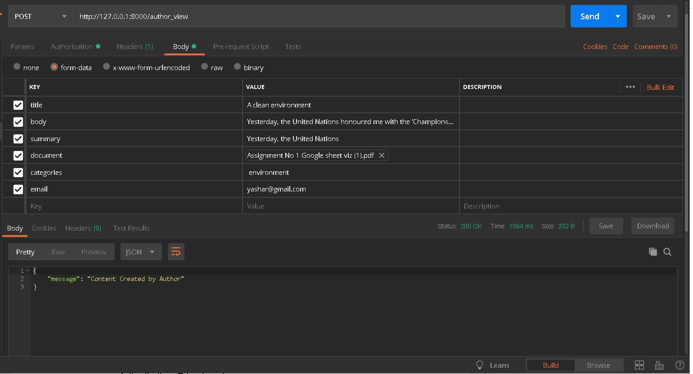
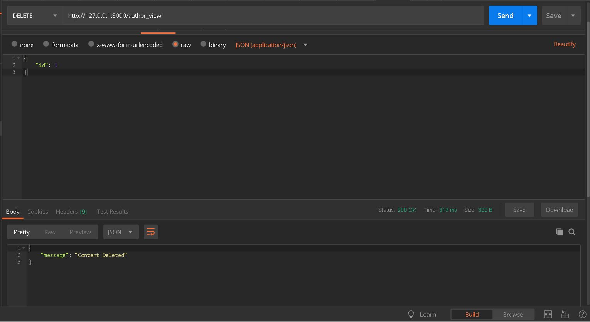

# Content_Management_System

## 1. Steps to get project setup and in running condition 
### Clone the Project 
```bash
git clone https://github.com/yashsarjekar/Content_Management_System.git
```
### Run Virtual Environment, by running this commend virtual environment will install and it will run.
```bash
pipenv shell
```
### Install Requirements
```bash
pip install -r requirements.txt
```
### Move to cms folder
 ```bash
 cd cms
 ```
 ### Makemigrations
 ```bash
 python manage.py makemigrations
 ```
 ### Migrate
 ```bash
 python manage.py migrate
 ```
 ### Createsuperuser provide Email,Password,Full name,Phone,Pincode
 ```bash
 python manage.py createsuperuser
 ```
### Run Django Server
```bash
python manage.py runserver
```
## 2. Restful API Structure
In a RESTful API, endpoints (URLs) define the structure of the API and how end users access data from our application using the HTTP methods - GET, POST, PUT, DELETE. Endpoints should be logically organized around collections and elements, both of which are resources.
Below is the structure of Our API


## 3. How To Use This API Complete Guide and Test Cases with output.
### .Author Successfully Register.
http://127.0.0.1:8000/author_register
method POST
for body contents refer the picture below.

### .Email Already Exist:
http://127.0.0.1:8000/author_register
method POST
for body contents refer the picture below.

### .Password Validation 
http://127.0.0.1:8000/author_register
method POST
for body contents refer the picture below.

### .Phone Validation
http://127.0.0.1:8000/author_register
method POST
for body contents refer the picture below.

### .Pincode Validation
http://127.0.0.1:8000/author_register
method POST
for body contents refer the picture below.

### .Required Fields
http://127.0.0.1:8000/author_register
method POST
for body contents refer the picture below.

### .Author Successfully Register without non required fields
http://127.0.0.1:8000/author_register
method POST
for body contents refer the picture below.

### .Author Successfully Login
http://127.0.0.1:8000/author_login
method POST
for body contents refer the picture below.

### .Author Invalid Credentials
http://127.0.0.1:8000/author_login
method POST
for body contents refer the picture below.

### .Author Faces Content Fields Constraints
http://127.0.0.1:8000/author_view
method POST
for body contents refer the picture below.

### .Author Content Created Successfully.
http://127.0.0.1:8000/author_view
method POST and provide Authorization Bearer Token
for body contents refer the picture below.

### .Author View the Content Created by him.
http://127.0.0.1:8000/author_view
method GET and provide Authorization Bearer Token
for body contents refer the picture below.

### .Author has right to delete the Content created by him.
http://127.0.0.1:8000/author_view
method DELETE and provide Authorization Bearer Token
for body contents refer the picture below.

### .Author has right to update the Content created by him.
http://127.0.0.1:8000/author_view
method PUT and provide Authorization Bearer Token
for body contents refer the picture below.

### .Admin users are created using Json data seeding
http://127.0.0.1:8000/admin_register
method POST 
for body contents refer the picture below.

### .Admin users login
http://127.0.0.1:8000/admin_login
method POST 
for body contents refer the picture below.

### .Admin users Cannot Create Content
http://127.0.0.1:8000/author_view
method POST 
for body contents refer the picture below.

### .Admin users Can read or view all the content created by authors
http://127.0.0.1:8000/admin_view
method GET and provide Authorization Bearer Token
for body contents refer the picture below.

### .Admin users Can delete all the content created by authors.
http://127.0.0.1:8000/admin_view
method DELETE and provide Authorization Bearer Token
for body contents refer the picture below.

here are few test cases for admin delete operation


### .Admin users can edit all the content created by authors.
http://127.0.0.1:8000/admin_view
method PUT and provide Authorization Bearer Token
for body contents refer the picture below.


### .Users can Search the Content 
http://127.0.0.1:8000/filter/?search=Computer
method GET


## 4. Conclusion 
### Hence we went through the process of creating a RESTful API using Django REST Framework.
